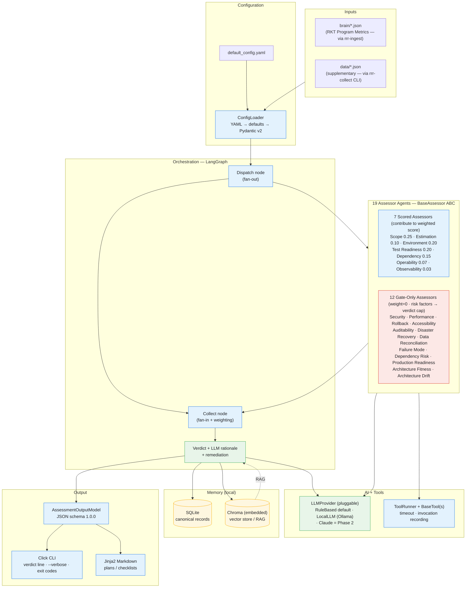

# 1. System Architecture

End-to-end view. Deterministic components in blue, AI components in green, storage in
amber. **Everything shown runs locally** (Phase 1, ADR-0010) — see
[diagram 9](09-deployment.md) for the local vs. Phase-2-external boundary.

> **Implementation status (M1–M6 complete + M7 Phase 2 Collect screen ✅ + hardening bundle ✅ — 727 tests as of 2026-07-10):** LangGraph `StateGraph` wrapper built
> (`orchestration/graph.py`, dispatch→collect, ADR-0002 impl-noted 2026-06-20); ThreadPoolExecutor runs inside
> the dispatch node. Chroma RAG built (optional 6D vector, ADR-0007 impl-noted 2026-06-19). `MockLLMProvider`
> + `LocalLLMProvider` + `BedrockProvider` (ADR-0019) + `ClaudeProvider` ✅ 2026-06-25 available.
> `rrr-ingest` HTML ingest layer ✅ 2026-06-22 (ADR-0018). NiceGUI `rrr-ui` ✅ 2026-06-26 (ADR-0020, `pip install rrr[ui]`).
> **M6 complete ✅ 2026-07-09:** Release Risk Tiers + ship-safety/delivery sub-scores; `OperabilityAssessor` + `ObservabilityAssessor` + `RollbackAssessor` (split from OperationalAssessor); 9 gate-only assessors (Accessibility, Auditability, DisasterRecovery, DataReconciliation, FailureMode, DependencyRisk, ProductionReadiness, ArchitectureFitness, ArchitectureDrift) — all ADR-0016 items 1–16 built.
> **M7 Phase 1 ✅ 2026-07-09:** `rrr-collect` CLI + `CollectorRunner` + `CollectorRegistry` + `InteractiveCollector` (ADR-0023).
> **M7 Phase 2 Collect screen ✅ 2026-07-10:** `_collect_panel()` in `rrr-ui` (FRESH/STALE/MISSING status view, InputContract-driven form, `_DictCollector` shared write path).
> **Hardening bundle ✅ 2026-07-10:** T-03 WAL mode, T-04 env-var interpolation, T-02 HTTP Basic Auth, T-07 SQLite migration guard.
> **Remaining:** M7 Phase 2 tool adapters (snyk, sonarqube, k6, axe, grafana, datadog); optional hosted persistence.

