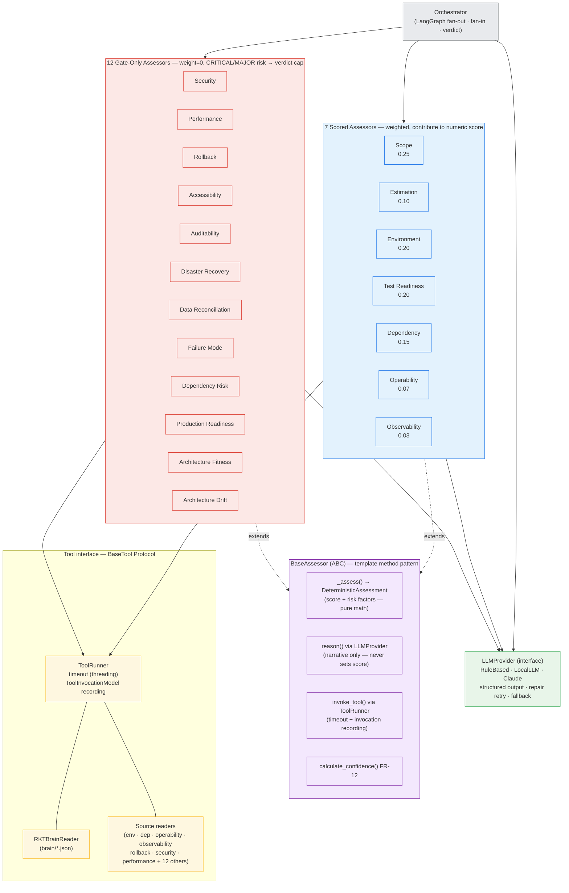

# 2. Agent Roles & Tool Interfaces

The orchestrator fans out to 19 assessor agents. Every assessor extends `BaseAssessor`
and reaches the outside world only through two interfaces: `ToolRunner` (data) and
`LLMProvider` (reasoning). **Scored assessors** contribute to the weighted score;
**gate-only assessors** (weight=0) produce CRITICAL/MAJOR risk factors that cap the verdict
via the GateEngine (ADR-0013/0014).

> **Scored assessors:** weight redistribution applies when a dim is unavailable (ADR-0005) —
> the score stays comparable across runs. Minimum 3 available or verdict = INCOMPLETE.
>
> **Gate-only assessors:** a single CRITICAL risk factor from any gate-only assessor caps the
> verdict at NO_GO regardless of the numeric score (ADR-0013). MAJOR → CONDITIONAL cap.
> Gate-only assessors are all opt-in via `sources.<dim>` config.
