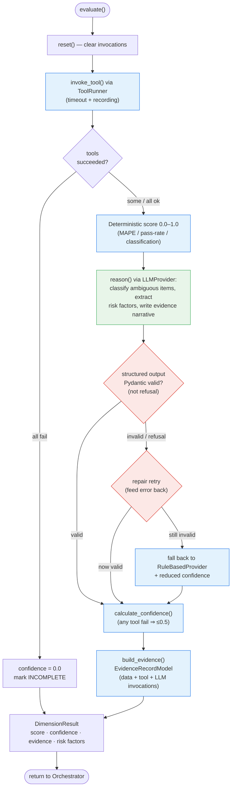

# 4. Assessor Internals + Guardrail

Inside one assessor: tools produce data, deterministic code produces the **score**,
Claude produces the **judgment**, and the Pydantic guardrail keeps bad generations out
of the pipeline (ADR-0009).

**Guardrail summary:** the provider never sets the numeric score or the verdict label; on
validation failure the dimension degrades to the `RuleBasedProvider` rather than emitting
unvalidated data. Works identically whether the provider is rule-based, a local LLM, or Claude.
