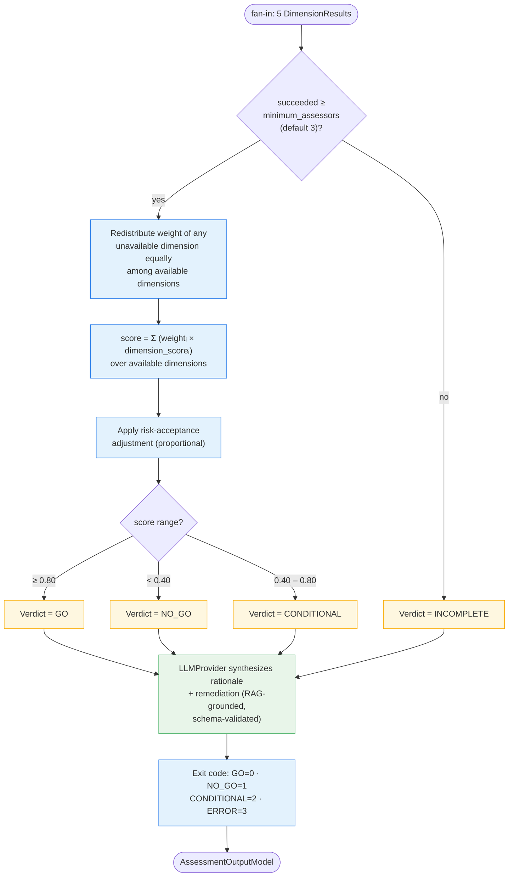

# 5. Verdict & Scoring Logic

How the orchestrator turns 5 `DimensionResult`s into a verdict — including weight
redistribution for unavailable dimensions and the score → label mapping.

> The verdict **label is a pure function of the numeric score** (and assessor count) —
> never of free-form LLM text. This is what keeps the verdict reproducible.
