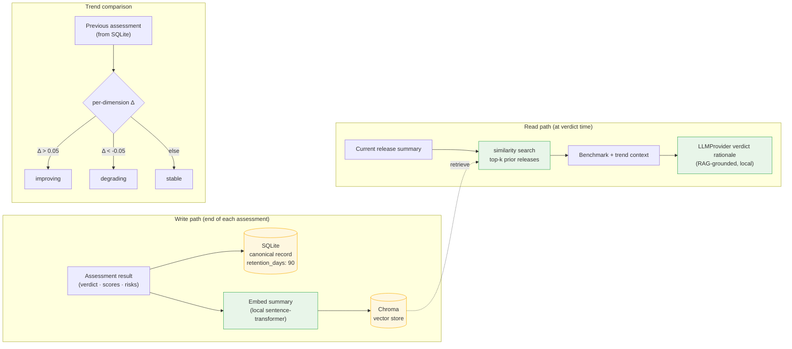

# 6. Memory & RAG

Two stores, kept consistent on each persist: **SQLite** is the system of record;
**Chroma** is the semantic index over it that powers RAG benchmarking (ADR-0003, ADR-0007).

> **Implementation status (M4 complete):** SQLite `AssessmentStore` ✅ built (ADR-0003).
> Chroma RAG ✅ built (optional 6D score-vector, `chroma_path: null` disables; `":memory:"` for tests;
> ADR-0007 impl-noted 2026-06-19). Note: the diagram shows `sentence-transformer` embeddings; as-built
> uses a 6-dimensional numeric vector `[scope, estimation, environment, test_readiness, dependency, score/100]`
> for dependency-free local operation. Full semantic embeddings are a Phase 2 / M5 enhancement.

