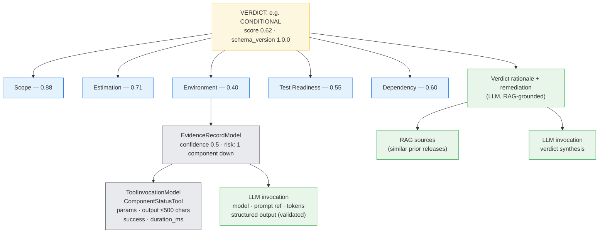

# 7. Audit Trail / Trace Path

The chain of evidence: every conclusion is navigable back to the data and the exact
tool/LLM calls that produced it. ISO 8601 millisecond timestamps throughout.

**Navigation:** `verdict → dimension scores → evidence records → tool invocations + LLM
invocations`. Each LLM invocation logs model, prompt reference, token usage, and the
validated structured output — so "why this verdict?" is fully answerable offline.
