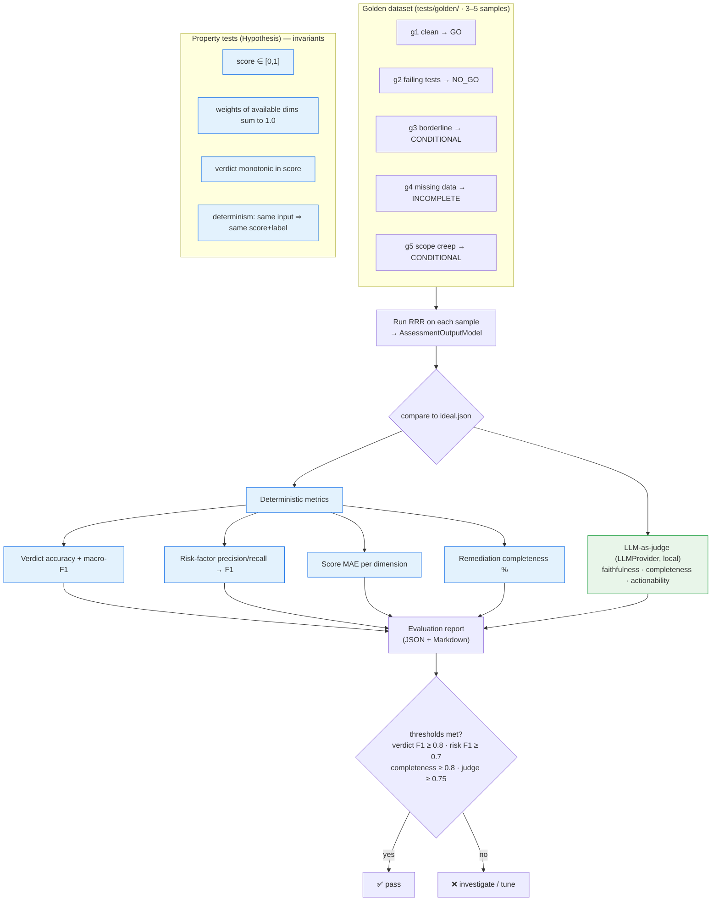

# 8. Evaluation Harness

Offline evaluation (not in the assessment hot path): run RRR on the golden dataset,
compute quantitative metrics deterministically, and score narrative quality with an
LLM-as-judge (ADR-0008, [../docs/evaluation-plan.md](../docs/evaluation-plan.md)).

> **Implementation status (M4 complete):** Golden dataset ✅ (5 fixtures, all `ideal.json` oracles
> authored 2026-06-17). Deterministic metrics ✅ (`tests/eval/metrics.py` — verdict accuracy 100%,
> macro-F1 1.000, all dim MAEs 0.000, mean risk-F1 0.800). `StructuralJudge` ✅ built 2026-06-23
> (`tests/eval/judge.py`) — checks narrative completeness, classification, confidence, rationale,
> risk-factor coverage; structural score 1.00 on all 5 fixtures. `EvalReportRenderer` ✅ built
> 2026-06-23 (`tests/eval/report.py`) — emits `docs/eval-report.md`. `ProseQualityJudge` ✅ built
> 2026-06-26 (`tests/eval/judge.py`) — live-LLM prose scoring via `ClaudeProvider`; API-key guard keeps CI
> offline-safe; eval report §4 added; FR-28 fully closed.

