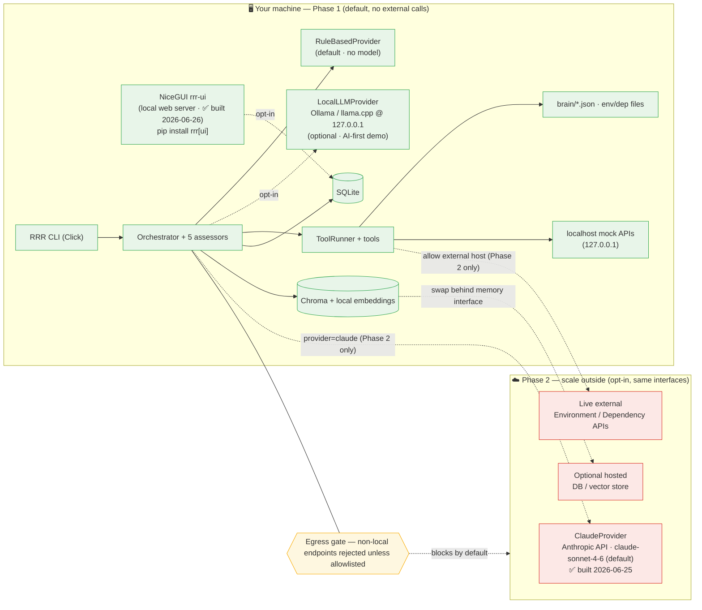

# 9. Deployment — Local-First Boundary (Phase 1) vs. External Scale (Phase 2)

The whole of Phase 1 runs inside one machine with no outbound calls (ADR-0010). Every
external capability sits behind an interface and is **off unless explicitly configured**
for Phase 2 — no rewrite to switch (ADR-0006).

> **Implementation status (M1–M6 complete + M7 Phase 1 complete — 708 tests as of 2026-07-09):** Phase 1 + Phase 2 fully complete. `ClaudeProvider` ✅ built 2026-06-25
> (Phase 2 opt-in). NiceGUI `rrr-ui` ✅ built 2026-06-26 (ADR-0020, `pip install rrr[ui]` — local web server).
> Live external APIs ✅ built 2026-06-28 (`ApiSource` HTTP transport). Hosted persistence interface ✅ (`AbstractAssessmentStore` + `RemoteAssessmentStore` stub) — remote backend implementation pending host/auth design.
> **M7 Phase 1 ✅ 2026-07-09:** `rrr-collect` CLI (ADR-0023). Remaining: M7 Phase 2 — `rrr-ui` Collect screen + tool adapters.

**Read it as:** green = on your machine (the entire Phase-1 product); red = external,
reachable only when you flip a config flag in Phase 2; amber = the egress gate that
rejects non-local endpoints by default. A fresh clone runs entirely in the green box.
